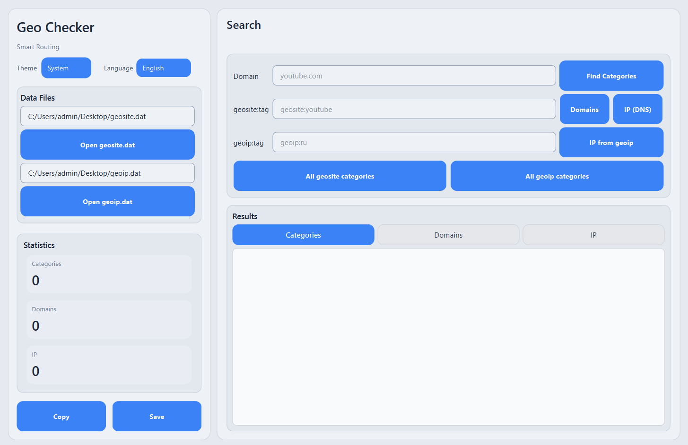

# Geo Checker

**Smart Routing** — Desktop tool for analyzing V2Ray / Xray `geosite.dat` and `geoip.dat` files.



## Features

- Parse and inspect `geosite.dat` (domain categories) and `geoip.dat` (IP/CIDR ranges)
- Search which categories a domain belongs to (e.g. `youtube.com` → `geosite:youtube`, `geosite:google`, ...)
- List all domains in a geosite tag (e.g. `geosite:youtube`)
- List all IP/CIDR ranges in a geoip tag (e.g. `geoip:ru`)
- DNS resolve: get real IPs for domains in a geosite category
- Dark / Light / System theme with live switching
- English and Russian UI
- GUI (Qt6) and CLI modes
- Single-file `.exe` packaging via Enigma Virtual Box (Windows)

## Requirements

- **C++17** compiler (GCC 9+, Clang 10+, MSVC 2019+)
- **CMake** 3.16+
- **Qt6** (Widgets, Core, Gui, Concurrent) — optional, for GUI
- **Protobuf** — auto-downloaded via FetchContent if not found on system

## Build

### Linux

```bash
# Install dependencies (Ubuntu/Debian)
sudo apt install cmake qt6-base-dev libprotobuf-dev protobuf-compiler build-essential

# Build
cd cpp
./build.sh
```

Binaries appear in `cpp/build/`:
- `geochecker` — GUI application
- `geochecker-cli` — command-line tool

To install the desktop entry and icon:

```bash
./install-linux-desktop.sh
```

### Windows (MinGW)

```bash
cd cpp
mkdir build && cd build
cmake .. -G Ninja -DCMAKE_BUILD_TYPE=Release -DCMAKE_PREFIX_PATH="C:/Qt/6.x.x/mingw_64"
cmake --build . -j%NUMBER_OF_PROCESSORS%
```

### Docker

```bash
# From project root
docker build -f cpp/Dockerfile -t geochecker .
docker run --rm geochecker ./build/geochecker-cli search /path/to/geosite.dat youtube.com
```

## CLI Usage

```bash
# Find which categories contain a domain
geochecker-cli search geosite.dat youtube.com

# List all domains in a category
geochecker-cli domains geosite.dat geosite:youtube

# List IP/CIDR ranges for a country
geochecker-cli geoip geoip.dat geoip:ru
```

## Single EXE Packaging (Windows)

Pack the GUI build + Qt DLLs into a single portable `.exe` using [Enigma Virtual Box](https://enigmaprotector.com/):

```
1. Build the project (Release)
2. Run windeployqt on the exe into deploy/
3. Run:  cpp\pack-enigma.bat
```

This produces `GeoChecker_packed.exe` — a standalone file that runs on any Windows machine without installation.

## Project Structure

```
proto/
  routercommon.proto        # Protobuf schema (V2Ray geosite/geoip format)
cpp/
  CMakeLists.txt            # Build system
  build.sh                  # Linux build script
  Dockerfile                # Docker build
  install-linux-desktop.sh  # Install .desktop entry and icon (Linux)
  pack-enigma.bat           # Enigma VB packing script (Windows)
  src/
    main.cpp                # GUI entry point
    main_cli.cpp            # CLI entry point
    mainwindow.cpp          # Qt GUI implementation
    dat_parser.cpp          # Protobuf parser for geosite/geoip
    geochecker_types.cpp    # RAII wrappers for protobuf types
  include/
    mainwindow.hpp          # GUI header
    dat_parser.hpp          # Parser API
    geochecker_types.hpp    # Type definitions
    lang_ui_config.hpp      # UI layout tuning constants
  resources/
    app_icon.ico            # Application icon
    geochecker.rc           # Windows resource file
    geochecker.desktop      # Linux desktop entry template
make_evb.js                 # Enigma VB project generator
```

## License

[Apache License 2.0](LICENSE)
