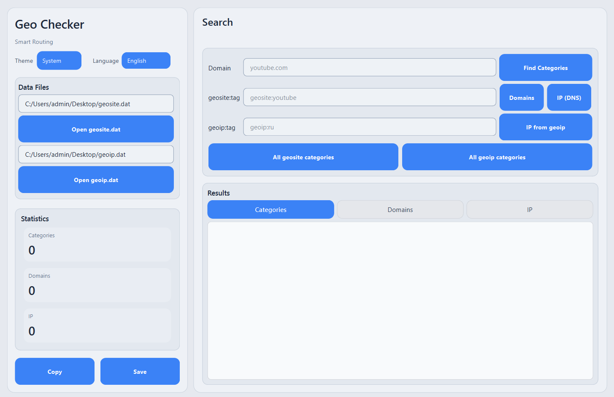

# Geo Checker

Utility for analyzing V2Ray / Xray routing files (`geosite.dat` and `geoip.dat`). Helps understand and debug geo-routing rules used in proxy clients like Xray-core, sing-box, V2Ray, and others.



## What it does

Proxy clients use `geosite.dat` and `geoip.dat` files to route traffic by domain categories and IP ranges. Geo Checker lets you inspect these files:

- **Find categories for a domain** — enter `youtube.com` and see all matching tags (`geosite:youtube`, `geosite:google`)
- **List domains in a category** — enter `geosite:youtube` and get the full domain list with rule types (plain, regex, full, root domain)
- **List IP/CIDR ranges** — enter `geoip:ru` and get all IP ranges for that country
- **DNS resolve** — resolve domains from a geosite category to real IP addresses

## Features

- Dark / Light / System theme
- English and Russian interface
- Parallel domain search across all categories
- Single portable `.exe` — no installation, no DLLs
- GUI (Qt6) and CLI modes

## Download

Go to [Releases](https://github.com/Maxim-Root/Geo-Checker/releases) and download `GeoChecker.exe`. Place `geosite.dat` and `geoip.dat` in the same folder — the app will find them automatically.

## Build from source

### Requirements

- C++17 compiler (GCC 9+, Clang 10+, MSVC 2019+)
- CMake 3.16+
- Qt6 (Widgets, Core, Gui, Concurrent) — optional, for GUI
- Protobuf — auto-downloaded if not found

### Windows (static single exe)

```bash
cd cpp
mkdir build-static && cd build-static
cmake .. -G Ninja -DCMAKE_BUILD_TYPE=Release -DCMAKE_PREFIX_PATH="C:/Qt/6.x.x/mingw_64_static" -DGEOCHECKER_FETCH_PROTOBUF=ON
cmake --build . --parallel
```

### Linux

```bash
sudo apt install cmake qt6-base-dev libprotobuf-dev protobuf-compiler build-essential
cd cpp && ./build.sh
```

### Docker

```bash
docker build -f cpp/Dockerfile -t geochecker .
docker run --rm geochecker ./build/geochecker-cli search /path/to/geosite.dat youtube.com
```

## CLI

```bash
geochecker-cli search geosite.dat youtube.com
geochecker-cli domains geosite.dat geosite:youtube
geochecker-cli geoip geoip.dat geoip:ru
```

## Project structure

```
proto/routercommon.proto          V2Ray protobuf schema
cpp/src/mainwindow.cpp            Qt6 GUI
cpp/src/dat_parser.cpp            Protobuf parser (lazy, parallel)
cpp/src/geochecker_types.cpp      RAII data wrappers
cpp/src/main.cpp                  GUI entry point
cpp/src/main_cli.cpp              CLI entry point
cpp/include/lang_ui_config.hpp    UI layout constants
cpp/resources/                    Icon, .rc, .desktop
```

## License

[Apache License 2.0](LICENSE)
